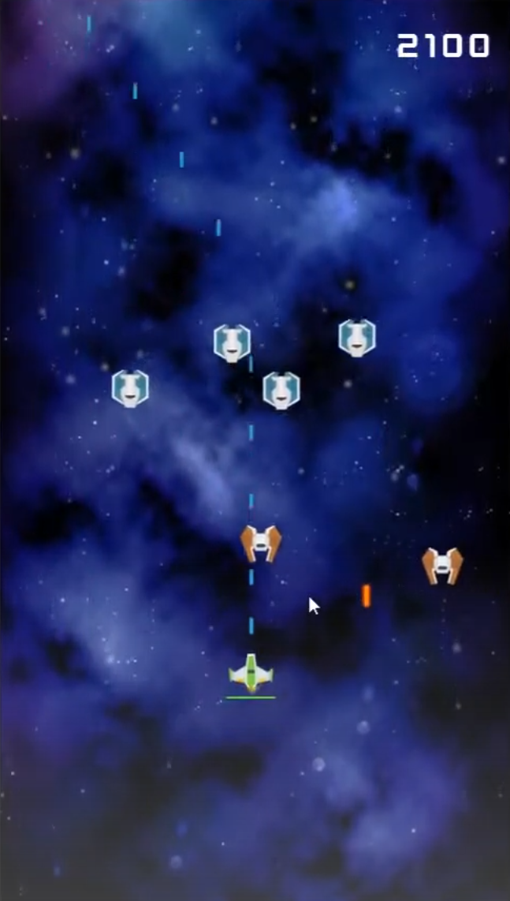
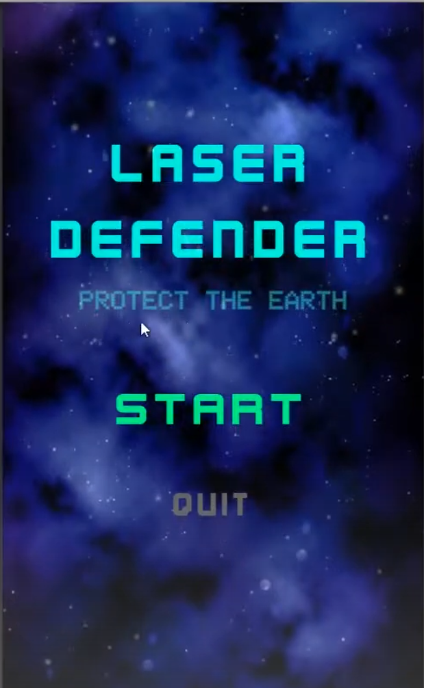

Laser Defender
===========

    

## Welcome to "Laser Defender" !

This single player game is a clone of Galaga. The game was built as a solo project following a course on Udemy and used to learn about projectiles, spawners and gameplay systems. The player controls a single ship and must destroy waves of enemy ships which appear at varying speeds and health. The player increases their score depending on the difficulty of the enemy destroyed.

## Table Of Contents

- [Snapshots](#Snapshots)
    + [LaserDefender](#Laser-Defender)
- [Getting Started](#getting-started)
    + [1. Setup-Unity](#1-Setup-Unity)
    + [2. Play The Game](#2-play-The-Game)
- [My Roles and Responsibilities](#my-roles-and-responsibilities)

## Snapshots

#### Laser Defender

Below are some screenshots of the game.

## Getting Started

### 1. Setup Unity

The Unity Editor is required. Download it from <a href="https://unity3d.com/get-unity/download">Unity3d.com/get-unity/download</a>.

1. Open the Unity Project of `./Laser Defender/`.
2. Open the Unity Console Window (Unity → Windows → General → Console). Confirm there are no warnings or errors.

### 2. Play The Game

**Standalone Build Play Session**
1. Open the project in the Unity Editor
2. Make a Unity Standalone Build (e.g. WindowsStandalone)
3. Run the Standalone Build of Laser Defender

**Unity Editor Play Session**
1. Open the project in the Unity Editor
2. Open the scene of `Laser Defender/Assets/Scenes/StartMenu.unity`
3. Run Unity Editor for Laser Defender

Enjoy!

## My Roles and Responsibilities

- UI/UX
- Level design and implementation
- Enemy spawning system
- Projectile and collision system

## Contact

* Siddharth Singhai - sidsinghai97@gmail.com
* [![LinkedIn][linkedin-shield]][linkedin-url]
* [![Portfolio][portfolioIcon-url]][portfolio-url]

[linkedin-shield]: https://img.shields.io/badge/-LinkedIn-black.svg?style=for-the-badge&logo=linkedin&colorB=555
[linkedin-url]: https://www.linkedin.com/in/siddharthsinghai97/
[portfolioIcon-url]: https://img.shields.io/badge/-Portfolio-brightgreen
[portfolio-url]: https://sidsinghai97.wixsite.com/portfolio
